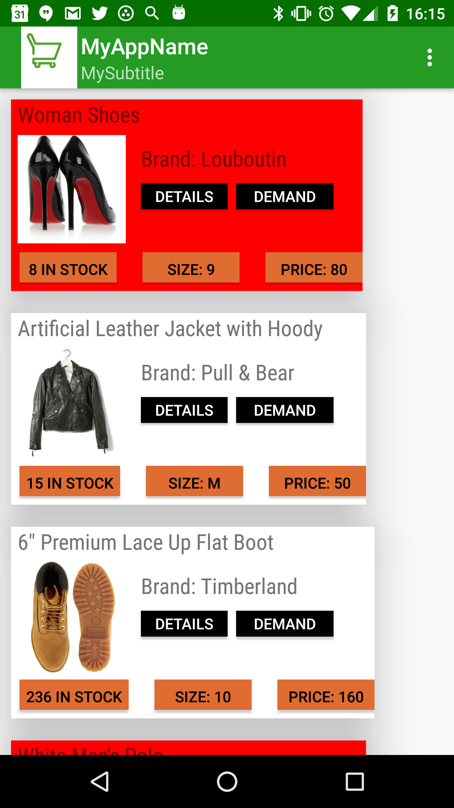

# Drive for Work backend - Retail Android app #
Customizable Android apk to demonstrate retail use case with Drive for Work.

The apk uses this [spreadsheet as backend](https://docs.google.com/spreadsheets/d/1zQMzthur_TkahfG-8-vBWQgXJVxdT9UnhHJavRJAHhI/edit?usp=sharing), mandatory to execute the apk. 
The apk makes use of JSON download functionality of Google Spreadsheets as explained [in this video](https://www.youtube.com/watch?v=RSgMEtRl0sw), and also [prediction API](https://developers.google.com/apps-script/advanced/prediction). 

The spreadsheet contains up to three Apps Script projects, one for the prediction API, another one to download data and another one to download customizable parameters, like logos, titles, subtitle and background color.

See info on Drive for Work here: [http://www.google.com/work](http://www.google.com/work), which offers unlimited storage and advanced audit controls.

## Usage

1) Launch the apk

2) If desired, open the spreadsheet backend and customize logo, title, subtitle. Click on Refresh on the apk

## Backend

The backend is a [Google Spreadsheet](https://docs.google.com/spreadsheets/d/1zQMzthur_TkahfG-8-vBWQgXJVxdT9UnhHJavRJAHhI/edit?usp=sharing), hosted on Drive for Work backend

## Libraries

The following libraries must be included for proper compilation and execution:
* picasso-2.4.0
* android-suppport-v4
* android-support-v7-recyclerview
* android-support-v7-cardview

## Android release

The apk can be downloaded from [here](https://drive.google.com/file/d/0B6IAELMrLfE5TDRhLUJUT05mUnc/view?usp=sharing).
This apk uses Material Design concepts (also transitions) compiled with SDK target 21 (5.0) and tested on Nexus 5 with lollipop.
IDE used is Eclipse Luna

## Screenshots

Main activity:

